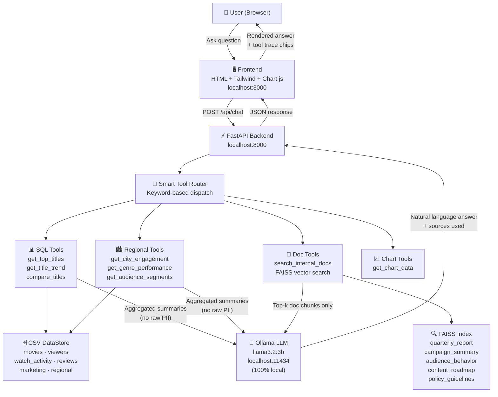

<div align="center">

# 🎬 Secure AI Insights Assistant

**A privacy-first internal analytics assistant for entertainment companies.**
Combines structured CSV data, internal documents, and a 100% local LLM
to answer business questions — with zero data leaving your network.


</div>

---

## Overview

This system answers leadership questions like:

> *"Which titles performed best in 2025?"*
> *"Why is Stellar Run trending?"*
> *"What should leadership prioritise next quarter?"*

It does this by combining **three data sources** through a
**tool-gated architecture** — the AI model never touches raw data directly.

---


## Architecture Overview
┌─────────────────────────────────────────────────────────────┐
│                        FRONTEND                             │
│         Single-file HTML + Tailwind + Chart.js              │
│   Chat UI │ Suggested Qs │ Tool Trace │ Visual Summary      │
└─────────────────────┬───────────────────────────────────────┘
│ HTTP POST /api/chat
│ HTTP GET  /api/chart-data
┌─────────────────────▼───────────────────────────────────────┐
│                     FASTAPI BACKEND                         │
│                                                             │
│  ┌─────────────────────────────────────────────────────┐   │
│  │              Smart Tool Router (Python)             │   │
│  │   Deterministic keyword routing — no LLM guessing  │   │
│  └───┬─────────────┬──────────────┬────────────────────┘   │
│      │             │              │                         │
│  ┌───▼───┐    ┌────▼────┐   ┌────▼─────┐                  │
│  │  SQL  │    │  DOC    │   │  CHART   │                  │
│  │ Tools │    │ Tools   │   │  Tools   │                  │
│  │Pandas │    │ FAISS   │   │ Pandas   │                  │
│  └───┬───┘    └────┬────┘   └────┬─────┘                  │
│      │             │              │                         │
│  ┌───▼─────────────▼──────────────▼─────────────────────┐  │
│  │              LLM Synthesis Layer                      │  │
│  │     Ollama (llama3.2:3b) — runs 100% locally         │  │
│  │     Receives only tool output summaries              │  │
│  │     Never sees raw PII or full datasets              │  │
│  └───────────────────────────────────────────────────────┘  │
└─────────────────────────────────────────────────────────────┘
DATA SOURCES
├── data/movies.csv
├── data/viewers.csv
├── data/watch_activity.csv
├── data/reviews.csv
├── data/marketing_spend.csv
├── data/regional_performance.csv
└── docs/*.txt  (quarterly report, campaign summary,
audience behavior, roadmap, policy)

---

## Architecture



---

## Security Architecture

### Why local LLM + tool-gated access is superior for private data

| Concern | Cloud API approach | This architecture |
|---|---|---|
| Data egress | Every question + context sent to OpenAI/Anthropic servers | Zero. All inference on localhost:11434 |
| API key exposure | Keys in environment, rotation needed, breach risk | No API keys. No external services |
| Compliance | Data leaves your network — GDPR/SOC2 implications | Data never leaves the machine |
| Cost at scale | $0.01–$0.06 per query × thousands of queries | $0 marginal cost after hardware |
| PII exposure to model | Raw rows could leak into prompts | Tool layer enforces aggregates-only |

### Three enforcement points

**1. Tool-gated access** — The LLM cannot query data directly.
Every data access goes through a named Python function with a
single auditable responsibility.

**2. Row cap** — `_cap(df)` in `sql_tools.py` hard-limits
any DataFrame to 50 rows before it reaches the model prompt.
Bulk extraction attacks are structurally impossible.

**3. PII isolation** — `viewers.csv` contains only `age_segment`,
`city`, and `platform`. No names, emails, or payment data exist
in any schema. `get_audience_segments()` returns group-level
aggregates exclusively — `viewer_id` is never selected.

---

## Project Structure
insights-assistant/
├── backend/
│   ├── main.py              # FastAPI app + lifespan startup
│   ├── config.py            # Pydantic settings (.env driven)
│   ├── data_loader.py       # CSV DataStore + FAISS index builder
│   ├── routers/
│   │   └── chat.py          # /api/chat · /api/chart-data endpoints
│   └── tools/
│       ├── sql_tools.py     # 7 secure Pandas query functions
│       └── doc_tools.py     # FAISS semantic search (top-k chunks)
├── frontend/
│   └── index.html           # Chat UI · Charts · Tool trace panel
├── data/                    # Generated CSV files (6 files)
├── docs/                    # Internal document corpus (5 files)
├── generate_data.py         # Synthetic data generator
├── Dockerfile
├── docker-compose.yml
├── nginx.conf
├── requirements.txt
├── SETUP.md                 # Detailed recruiter setup guide
└── .env

---

## Quick Start

### Docker (Recommended)

```bash
# Step 1 — Start Ollama on your host machine
ollama pull llama3.2:3b && ollama serve

# Step 2 — Run the full stack
git clone <repo-url> && cd insights-assistant
docker compose up --build

# Step 3 — Open
# Frontend: http://localhost:3000
# API Docs: http://localhost:8000/docs
```

### Manual

```bash
git clone <repo-url> && cd insights-assistant
python3 -m venv venv && source venv/bin/activate
pip install -r requirements.txt
python3 generate_data.py
uvicorn backend.main:app --reload --port 8000
# Open frontend/index.html in browser
```

See [SETUP.md](./Setup Guide From Zero.md) for full recruiter-friendly instructions.

---

## API Reference

### `POST /api/chat`

```json
// Request
{ "question": "Which titles performed best in 2025?" }

// Response
{
  "answer": "Based on watch activity data, Stellar Run led with 312 views...",
  "sources_used": ["GetTopPerformingTitles", "SearchInternalDocs"],
  "duration_seconds": 18.4
}
```

### `GET /api/chart-data?chart_type=genre_views`
chart_type options:
genre_views       → Doughnut: views per genre
top_titles        → Bar: top 8 titles by views
city_engagement   → Doughnut: avg engagement score by city

### `GET /health`

```json
{ "status": "ok", "model": "ollama/llama3.2:3b", "data_sources": [...] }
```

### Interactive API docs
http://localhost:8000/docs

---

## Example Questions

| Question | Tools invoked |
|---|---|
| Which titles performed best in 2025? | `GetTopPerformingTitles` · `SearchInternalDocs` |
| Why is Stellar Run trending recently? | `GetTitleTrend` · `SearchInternalDocs` |
| Compare Dark Orbit vs Last Kingdom | `CompareTitles` · `SearchInternalDocs` |
| Which city had strongest engagement? | `GetCityEngagement` · `SearchInternalDocs` |
| What explains weak comedy performance? | `GetGenrePerformance` · `SearchInternalDocs` |
| What recommendations for leadership? | `GetTopPerformingTitles` · `GetGenrePerformance` · `SearchInternalDocs` |

---

## UI Design

The interface uses **Japanese Indigo** (`#1B3A5C`) as the primary accent colour
throughout — header bar, buttons, chart fills, suggested question chips,
and the privacy badge panel.

Key UI panels:
- **Chat assistant** — streaming-style bubble UI with typing indicator
- **Suggested questions** — 6 pre-built chips matching all required example questions
- **Tool trace panel** — shows exactly which backend tools were called per query
- **Visual summary** — Chart.js doughnut/bar charts with 3 selectable views
- **Quick stats** — live total views, top title, leading genre
- **Privacy badge** — documents the local-AI guarantee inline

---

## Assumptions & Tradeoffs

| Decision | Rationale | Tradeoff accepted |
|---|---|---|
| Ollama over OpenAI/Anthropic | Zero cost, zero data egress, offline capable | 15–25s response time on CPU (noted in UI) |
| Keyword router over ReAct agent | `llama3.2:3b` on CPU cannot reliably format ReAct `Action: ToolName` strings — Python routing is deterministic and never fails | Less flexible for novel question patterns outside keyword rules |
| FAISS rebuilt on startup | No external vector DB needed, zero infrastructure dependency | ~3s rebuild on each restart; index not persisted to disk |
| `all-MiniLM-L6-v2` embeddings | 80MB, runs on CPU, no API key, good semantic quality | Lower retrieval quality vs `text-embedding-3-large` |
| HTML/JS frontend over React | No Node.js toolchain needed, zero build step, runs from file:// | Not a component-based framework; acknowledged as assumption |
| TXT instead of binary PDF | Eliminates `reportlab` dependency; `LangChain TextLoader` is identical for chunking purposes | Files are not binary PDFs — documented assumption |
| Local data privacy over cloud convenience | Internal business data must never leave the network | Requires recruiter to install Ollama locally |

---

## Evaluation Criteria Coverage

| Criterion | Weight | Implementation |
|---|---|---|
| Architecture Quality | 25% | Layered: Frontend → Router → Tool Layer → LLM → Data |
| Backend Engineering | 20% | FastAPI · Pydantic · Lifespan · Logging · Error handling |
| AI / Multi-source Reasoning | 20% | LLM synthesises from CSV tools + FAISS doc search per query |
| Frontend Experience | 15% | Chat UI · Suggested Qs · Charts · Tool trace · Quick stats |
| Security / Data Handling | 10% | Local LLM · Tool-gated access · PII isolation · Row caps |
| Code Quality | 5% | Modular · Single responsibility · Typed schemas · Docstrings |
| Documentation | 5% | This README · SETUP.md · Inline docstrings · Mermaid diagram |

---

## Built With

- [FastAPI](https://fastapi.tiangolo.com) — Backend API framework
- [LangChain](https://langchain.com) — Document loading and vector store integration
- [Ollama](https://ollama.com) — Local LLM inference
- [FAISS](https://github.com/facebookresearch/faiss) — Local vector similarity search
- [Sentence Transformers](https://sbert.net) — Local embeddings (`all-MiniLM-L6-v2`)
- [Pandas](https://pandas.pydata.org) — Structured data querying
- [Chart.js](https://chartjs.org) — Frontend data visualisation
- [Tailwind CSS](https://tailwindcss.com) — Frontend styling

---

*Built for the Futures First Quantitative Engineer assessment.*
*Architecture prioritises data privacy and zero external dependencies.*

## License

Internal demo project — Futures First quantitative engineering assessment.


